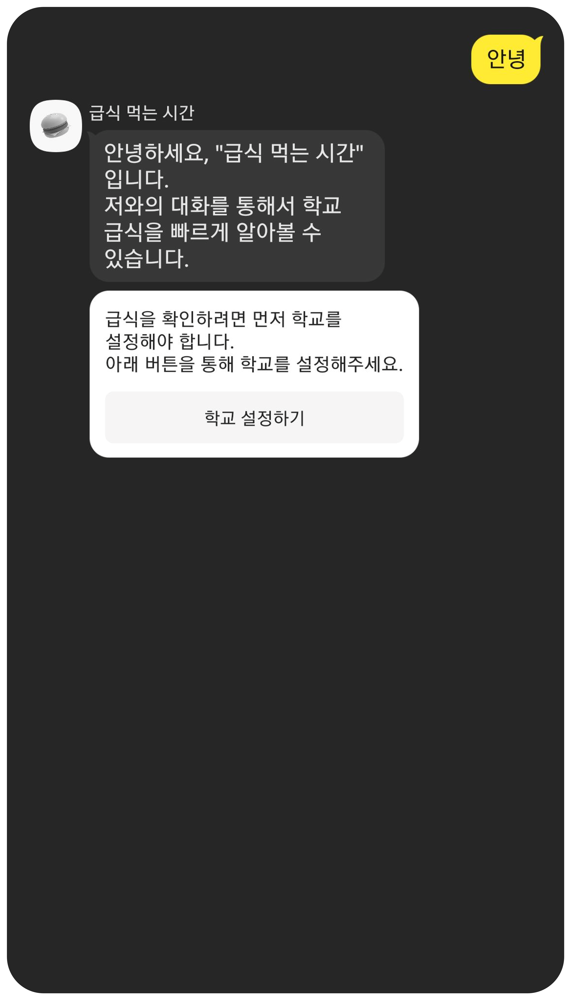
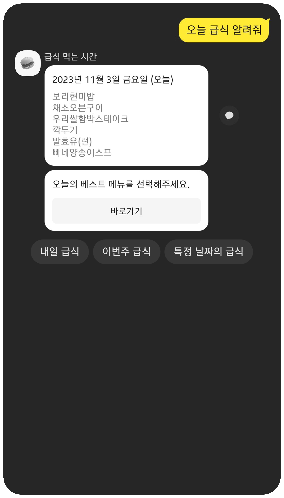
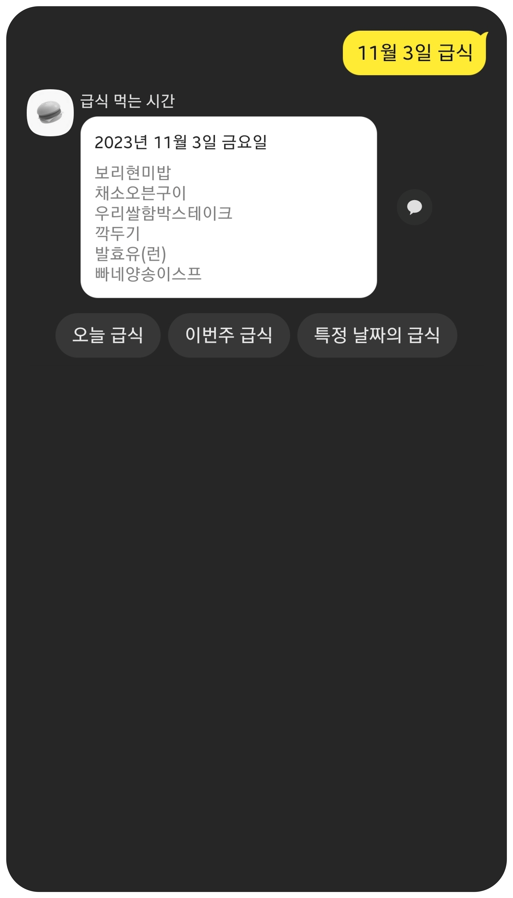
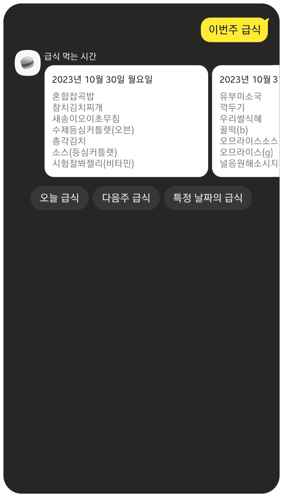
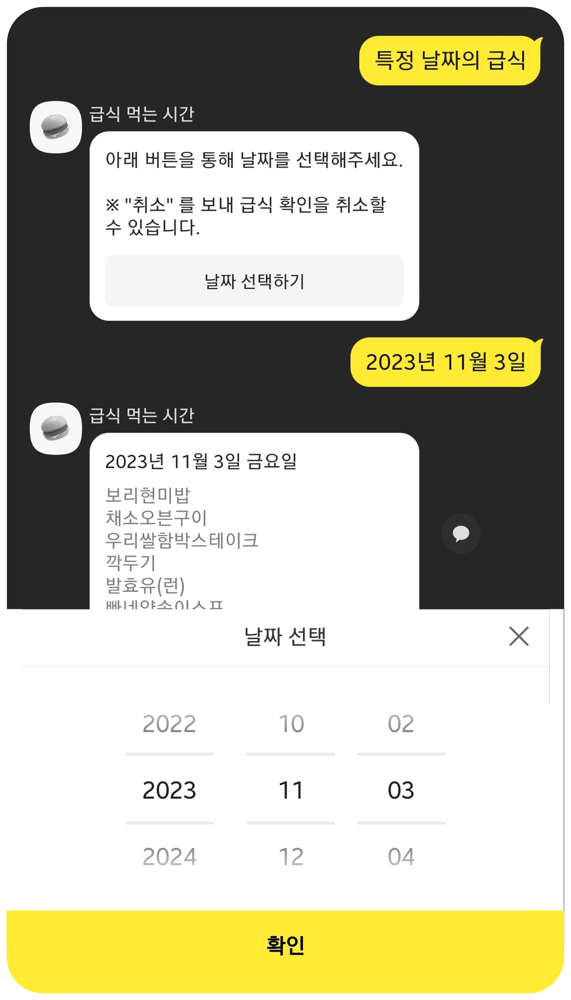
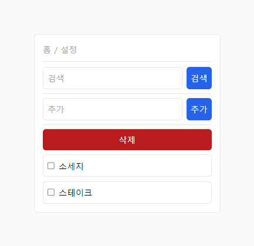
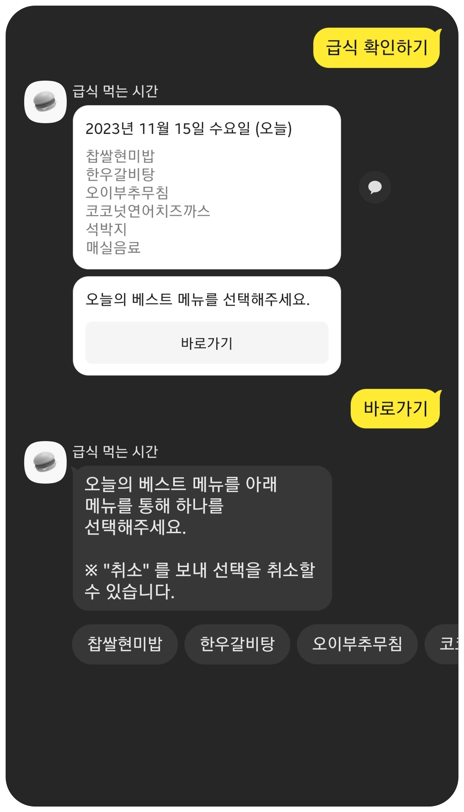
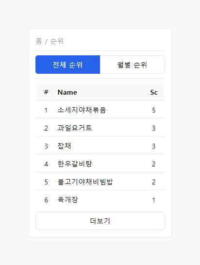

# 학교 급식 챗봇
[https://pf.kakao.com/_Mxhxaxdxj](https://pf.kakao.com/_Mxhxaxdxj)  
[https://khw2.kr/m/](https://khw2.kr/m/)

학생들의 편의성을 위해 학교 외의 장소에서도 급식에 대한 정보를 확인 할 수 있도록 하는 Python Flask로 제작된 웹 어플리케이션, 프로젝트입니다.

## 프로젝트 구성
```
├─ .venv
├─ src
│   ├─ data
│   │   │  mdata.*.json
│   │   │  mdata.json
│   │   └─ udata.json
│   │  back.py
│   │  front.py
│   └─ init.py
├─ static
│   ├─ img
│   └─ index.js
├─ templates
├─ test
│  .env
│  .gitignore
│  readme.md
│  reqiuirements.txt
│  run.py
└─ tailwind.config.js
```

```bash
$ python app.py
```

## 이용된 API
- NEIS API : 급식 정보 및 학교 정보 확인

## 개념
본 문서를 이해하기 쉽도록 일부 개념들을 설명해 두었습니다.


### 엔티티
위의 "**오늘 급식 알려줘**"라는 발화에서 "**오늘**"은 `@bot.date`란 엔티티로 인식됩니다.

### 엔트리
`@bot.date` 엔티티로 인식되기 위해서는 특정 키워트가 엔티티의 엔트리로 등록되어 있어야 합니다.

`@bot.date` 엔티티의 엔트리로는 "오늘", "내일", "*월 *일", "이번주" 등이 등록되어 있습니다.

### 파라미터
`@bot.date` 엔티티로 인식된 값; "**오늘**"은 `bot_date`란 파라미터명으로 정의되어 연결된 스킬 서버에 전송됩니다.

서버에서는 `bot_date` 파라미터의 값을 받아와 값에 해당하는 날짜의 급식 정보를 이용자에게 보냅니다.

## 기능들

|기능명|설명|발화|
|:---:|:---|:---|
|[학교 설정](#학교-설정)|정보를 받아올 학교를 설정합니다.|학교 설정, 학교 설정하기, 학교 선택 등|
|[급식 확인](#급식-확인)|학교의 급식 정보를 받아옵니다.|급식 확인, 급식 확인하기, 급식 알려줘 등|
|[선호 급식 메뉴 설정](#선호-급식-메뉴-설정)|급식 중 선호하는 메뉴를 설정합니다.|선호 급식 메뉴 설정, 선호 메뉴 등록, 선호 급식 추가 등|
|[베스트 메뉴 선택](#베스트-메뉴-선택)|급식 중 베스트 메뉴 하나를 선택합니다.|-|
|~~알러지 설정~~|알러지를 설정해 관련 메뉴를 표시합니다.|-|



### 학교 설정
서비스를 처음 이용하는 경우 학교 설정 후 다양한 기능(해당 학교의 정보 확인 등)들을 이용할 수 있습니다.

1. 발화 입력
2. 설정된 학교 확인 후, 학교 설정울 할지 결정
3. 특정 학교의 이름을 입력 (예: ◯◯초, ◯◯◯고등학교)
4. 검색된 학교 중 해당 학교를 선택


### 급식 확인
서비스의 주 기능으로, 설정되어 있는 학교의 급식을 알려줍니다.

특정 키워드를 갖는 발화나 특정 행동(버튼을 누르는 등)을 통해 아래 타입 중 하나로 급식 확인이 됩니다.

|타입|특정 키워드|
|:---:|:---|
|[바로가기형](#바로가기형)|-|
|[일반형](#일반형)|오늘, 내일, 어제, 다음주 오늘, **월 **일 등|
|[케로셀형](#케로셀형)|이번주, 저번주, 다음주 등|
|[플러그인형](#플러그인형)|-|
|[자동형](#자동형)|-|

> 각 타입의 시작 기준으로 중복되는 여러 값을 갖고 있는 경우 우선도가 높은 타입으로 급식이 확인됩니다. (우선도는 아래 타입의 순서와 같습니다)  
> 또한, 특정 파라미터 기준에 맞지 않는 다른 값을 입력하는 경우 급식이 자동형으로 확인됩니다,  
> 예: "**11월 11일 다음주 급식을 알려 줘**"의 경우 급식이 일반형으로 확인됩니다.

#### 바로가기형
"특정 날짜의 급식"을 제외한 QuickReplies 버튼을 통해서 급식을 확인하는 경우, QuickRepies의 clientExtra의 데이터를 받아와 해당 값에 맞는 날짜의 급식을 알려줍니다.

#### 일반형
특정 파라미터에 맞는 어느 날짜의 급식 정보를 알려줍니다.

1. 특정 파라미터를 갖는 발화 입력
2. `@bot.date` 파라미터의 값을 받아와 해당 값에 맞는 날짜의 급식 확인
<!-- 3. `regularMealRes(req, dt, opt)` -> `getMealData(req, dict)` -> 급식 정보 리턴 -->
<!-- 4. `getMealData` - 이용자 정보를 통해 급식 정보 리턴 -->
<!-- 5. `updateMealData` - 이용자가 설정해둔 선호 급식 메뉴로 급식 정보 업데이트 -->
<!-- 6. 급식 확인 -->

 

#### 케로셀형
특정 파라미터를 갖는 어느 주의 급식 정보를 알려줍니다.

1. 특정 파라미터를 갖는 발화 입력
2. `@bot.date` 파라미터의 값을 받아와 해당 값에 맞는 날짜의 급식 확인
<!-- 2. `carouselMealRes` - 이용자 req 받아옴 -->
<!-- 3. `udata.json` 에서 이용자 정보(학교 코드 등)를 받아옴 (데이터가 없을 경우 `isUserInData` 를 통해 이용자 정보 추가 후 `CError`) -->
<!-- 4. `getMealData` - 이용자 정보를 통해 급식 정보 리턴 -->
<!-- 5. `updateMealData` - 이용자가 설정해둔 선호 급식 메뉴로 급식 정보 업데이트 -->



#### 플러그인형
카카오톡의 플러그인 기능을 통해 날짜 값을 받아와 해당하는 급식 정보를 알려줍니다.

1. "특정 날짜의 급식" QuickReplies 버튼 이용
2. 카카오톡 플러그인 기능을 통해 날짜 값을 받아와 해당하는 급식 정보를 확인



#### 자동형
아무런 타입으로 급식이 확인되지 않는 경우, 현재 시각이 20시가 넘는다면 내일의 급식 정보를 알려주고, 아니라면 오늘의 급식 정보를 알려줍니다.

### 선호 급식 메뉴 설정
"**선호 급식 메뉴 설정**"은 카카오톡 외부의 웹사이트에서 이용자가 원하는 급식 메뉴의 키워드을 설정해, 급식 확인 시 해당 키워드를 갖는 메뉴에 ❤️ 표시를 해주는 기능입니다.

[https://khw2.kr/m/config](https://khw2.kr/m/config)



### 베스트 메뉴 선택
오늘이나 어제의 급식을 확인하는 경우, 그 날의 베스트 메뉴를 하나 선택할 수 있습니다.



추가로, 선택된 메뉴는 급식 순위로 올라가며, 아래 링크를 통해 확인할 수 있습니다.  

[https://khw2.kr/m/rank](https://khw2.kr/m/rank)

아래는 예시 화면입니다.



## 데이터 구조

### 이용자 데이터
`src/data/udata.json` 위치에 저장되며, 아래는 이용자가 처음 챗봇을 이용할 때 저장되는 최초 구조와 구조의 예시입니다.

```json
{
  "<uid>": {
    "schoolId": [null, null],
    "schoolFav": [],
    "mealFav": [],
    "settings": {
      "allergicMeal": false,
      "notifMeal": false
    },
    "usage": 0
  }
}
```

```json
{
  "example": {
    "schoolId": ["A00", "000"],
    "schoolFav": [
      ["A00", "000"]
    ],
    "mealFav": [
      "소세지",
      "스테이크"
    ],
    "settings": {
      "allergicMeal": false,
      "notifMeal": false
    },
    "usage": 0
  }
}
```

### 급식 데이터
`src/data/mdata.json` 위치에 저장되고, 월별 급식 데이터는 `src/data/mdata.*.json` 위치에 저장되며, 구조는 똑같습니다.

```json
{
  "<mealName>": {
    "score": [
      {"<uid>": "231103"}
    ]
  }
}
```